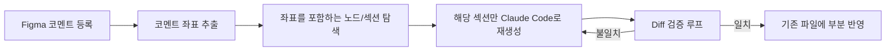

### 이전 이야기

[1편](https://white-jang.github.io/#/2025-06-30-FigmaToComponent01)에서 Antigravity와 Claude Code, 이미지와 Figma MCP를 놓고 이것저것 비교해봤던 이야기를 했다. 결론은 **Claude Code + Figma MCP** 조합이었고, `DESIGN_RULES.md`와 `PUB_RULES.md`를 만들어 디자인 시스템과 클래스 재사용 규칙을 학습시키면서 퍼블리싱 결과물의 퀄리티를 어느 정도 끌어올리는 데까지 성공했다.

**그런데 딱 거기까지였다.** 한 번 잘 뽑아내는 것과, 계속 잘 유지하는 것은 완전히 다른 문제였다.

### 문제: 디자인이 바뀔 때마다 나는 자꾸 다시 만들고 있었다 😔

퍼블리싱을 한 번 끝냈다고 일이 끝나는 게 아니었다. **디자이너(사실상 우리 팀이긴 함)가 Figma에서 버튼 위치 하나, 컬러 하나만 바꿔도 딜레이가 심해졌다.** 한 페이지를 만드는 데에 2~3일. 상시 업무가 있으니 더 빠르게 작업할 수 없었고, 팀원들이 내 작업이 완수되길 기다리는 게 미안해지기 시작했다.

더 큰 문제는 따로 있었다. **매번 급하게 마크업을 쳐내다 보니, 결과물이 기존 Atomic 컴포넌트(Button, DataTable 등)와는 무관한 일회성 퍼블리싱 코드로 쌓이기 시작한 것이다.** 당장은 화면이 똑같아 보이지만, React 컴포넌트로 옮기는 팀원 입장에서는 퍼블리싱 코드를 보고 컴포넌트를 찾아 재활용하는 상황이 반복됐다. 이것 또한 병목을 일으키는 요소라고 생각했다.

**정리하면 이랬다.**

- 디자인 변경 → 개발자가 수동으로 HTML/CSS 재작업 → 소요 시간 +1일 추가
- 재작업 결과물이 기존 컴포넌트와 분리된 일회성 마크업으로 누적

이쯤 되니 그런 생각이 들었다. **"퍼블리싱을 자동화했으면, 이 반복 재작업도 자동화할 수 있지 않을까?"**

### 해결: "그럼 이것도 자동화해보자" — 동기화 파이프라인 설계

목표를 다시 잡았다. 이번엔 한 번 잘 만드는 것이 아니라 **변경사항을 계속 반영하는 것이 기준**이었다. 그래서 아래 네 가지를 축으로 파이프라인을 설계했다.

#### 1. Figma 코멘트 감지 → 자동 반영

디자이너가 Figma에 특정 [코멘트 규칙 예: `#update`] 코멘트를 남기면, 이를 감지해 Claude Code가 자동으로 해당 프레임의 변경 여부를 확인하고 작업을 시작하도록 만들었다. **더 이상 "저 여기 바뀌었어요, 다시 만들어주세요"라는 말을 사람이 직접 전달할 필요가 없도록 했다.**

#### 2. 좌표 매칭 로직으로 부분 갱신

처음엔 변경 감지가 되면 프레임 전체를 다시 만드는 방식으로 시작했는데, 이러면 자동화를 해도 여전히 비효율적이었다. **버튼 컬러 하나 바뀐 걸로 테이블 3개짜리 페이지를 통째로 재생성할 필요는 없었으니까.**

여기서 핵심은 **Figma 코멘트 자체가 좌표 정보를 갖고 있다는 점**이었다. 코멘트가 달리면 그 코멘트가 찍힌 좌표를 기준으로 어떤 노드(섹션)에 해당하는지 역으로 매칭해서, **이 코멘트는 여기에 달렸으니 이 영역만 건드리면 된다**는 식으로 재생성 범위를 좁혔다. 프레임 전체를 비교하는 대신, **코멘트 좌표 → 해당 좌표를 포함하는 노드 탐색 → 그 노드(및 하위 요소)만 재생성** 순서로 동작하게 만든 것이다. 대략적인 흐름은 이렇다.

#### 3. Atomic 컴포넌트 연동 규칙

일회성 마크업 문제를 풀기 위해, `PUB_RULES.md`를 한 단계 더 발전시켜 **생성된 마크업 패턴을 기존 Atomic 컴포넌트(Button, DataTable 등)로 치환하는 변환 규칙**을 정의했다. 예를 들어 특정 구조의 `div + button` 조합이 감지되면 신규 마크업을 만드는 대신 기존 `Button` 컴포넌트 클래스를 매칭해 재사용하도록 유도하는 식이다.

이 규칙 덕분에 자동으로 생성된 결과물이 팀원들이 React로 옮길 때도 "어? 이건 이미 정의한 컴포넌트네" 하고 바로 알아볼 수 있는 구조가 되었다.

#### 4. Self-healing 검증 루프

가장 신경 썼던 부분이다. **AI가 만든 결과물을 사람이 매번 눈으로 검수하면 자동화의 의미가 퇴색된다고 생각했다.** 그래서 Figma 원본과 실제 구현 결과물을 자동으로 비교·판정하고, 불일치가 발견되면 재작업을 지시하는 루프를 만들었다.

비교는 스크린샷을 픽셀 단위로 맞대보는 방식이 아니라, **Figma MCP가 넘겨주는 노드 데이터(색상, 크기, 위치 등 스타일 속성이 담긴 JSON)를 Python으로 받아서 분석하는 방식**이었다. Figma 원본 노드의 속성 값과 실제 구현된 코드의 스타일 속성 값을 데이터 레벨에서 직접 비교한 것이다. 이 방식 덕분에 "눈으로 보기엔 비슷한데 색상 hex 값이 미묘하게 다르다" 같은, 스크린샷만으로는 알아채기 힘든 차이도 값 단위로 정확히 잡아낼 수 있었다.

자동화 방식은 단순하지만 확실했다. **모든 변경 건은 최소 1회 검증 루프를 무조건 거치도록 강제했고, 비교 결과 불일치가 나오면 일치할 때까지 "재생성 → 재검증"을 반복**하도록 만들었다. 즉 사람이 "이제 검증해봐"라고 트리거를 걸 필요 없이, 변경이 감지되는 순간부터 결과가 원본과 맞아떨어질 때까지는 파이프라인이 스스로 도는 구조였다.

디자인 변경사항이 실제로 반영됐는지, 사람이 놓치기 쉬운 디테일(버튼 컬러, 넓이 차이 등)까지 자동으로 잡아내면서 **"일단 눈으로 보기엔 똑같은데?" 하고 넘어가던 순간들이 사라졌다.**

### 성과: PoC 단계에서 확인한 가능성

아직 정식 도입 전, PoC 단계에서의 결과지만 방향성은 확실히 확인할 수 있었다.

| 항목                       | 기존 방식     | 파이프라인 도입 후                     |
| -------------------------- | ------------- | -------------------------------------- |
| 디자인 변경 반영 소요 시간 | 2~3일         | 3~4시간                                |
| 재작업 단위                | 프레임 전체   | 변경 섹션만                            |
| 결과물 형태                | 일회성 마크업 | 기존 컴포넌트 연동 구조                |
| 스타일 불일치 발견 시점    | QA 단계       | 자동 검증 루프에서 상당 부분 사전 발견 |

특히 **자동 검증 루프가 버튼 컬러처럼 사람이 눈으로 보면 무심코 지나치기 쉬운 스타일 diff를 상당수 잡아냈다는 점**이 인상 깊었다. 물론 완벽하진 않아서 요소와 요소의 마진 차이 등은 여전히 사람이 한 번 더 봐야 했지만, 기존에는 이런 디테일이 QA 단계에서야 발견되곤 했던 것에 비하면 그 전 단계에서 상당 부분 걸러지는 구조가 만들어진 셈이다.

물론 아직 몇 건 정도의 테스트 케이스로 확인한 가능성이라 전체 프로덕션에 그대로 적용하기엔 이르다.

실제로 테스트해보니 재밌는 패턴이 하나 보였다. **버튼처럼 스코프가 작은 대상은 컬러든 크기든 몇 번을 연속으로 바꿔도(두 번째, 세 번째 변경까지) 좌표 매칭이 정확하게 대상을 잡아냈다.** 그런데 레이아웃 변경처럼 스코프가 큰 대상을 건드리면 이야기가 달라졌다. **첫 번째 변경까지는 얼추 잘 따라오다가, 두 번째 변경부터 매칭이 어긋나기 시작한 것이다.**

코멘트 자체는 매번 정확하게 감지됐다는 게 힌트였다. 즉 **"코멘트가 달렸다"는 트리거 자체는 문제가 없는데, "그래서 정확히 어디까지가 이 변경의 영향 범위인가"를 판단하는 부분에서 흔들리고 있었던 것이다.** 좌표 하나로 노드를 특정하는 지금 방식이 작은 대상에는 잘 맞지만, 여러 요소를 아우르는 큰 스코프의 변경에는 좌표 매칭 로직 자체를 좀 더 정교하게 다듬어야 할 수도 있겠다는 생각이 들었다.

테스트 케이스도 지금보다 훨씬 다양하게 쌓아야겠지만, **이 PoC로 "이 방향이 아예 안 되는 건 아니다"라는 가능성을 확인한 것만으로도 충분히 만족스러운 결과였다.** 하지만 그럼에도 여전히

1. 디자인 고도화를 어떻게 해야 더 끌어올릴 수 있을지
2. 검증 루프에 소요되는 시간을 줄일 수 있는 방법은 뭔지
3. 디자인 시스템을 도입하면 더 쉽고 빠르게 검증할 수 있을지
4. 코멘트를 감지하는 루프 주기는 정말 알맞은지
5. 실제로 디자이너와 협업할 때 이런 자동화 도구를 만든다면 어떻게 협업할 수 있을지

같은 의문점이 계속해서 남아있다.

---

### 회고

1편에서는 "AI가 얼마나 잘 만들어주는가"가 고민이었다면, 2편에서는 **AI가 만든 결과물을 어떻게 계속 신뢰할 수 있는 구조로 유지할 것인가**가 고민이었다. 돌이켜보면 오히려 후자가 더 어려운 문제였다. 한 번 잘 만드는 건 프롬프트와 컨텍스트 싸움이었지만, 계속 잘 유지되게 만드는 건 결국 **검증 루프와 규칙을 얼마나 촘촘하게 설계하느냐**의 문제였기 때문이다.

여전히 한계는 있다. 좌표 매칭 로직을 큰 스코프의 변경에도 잘 맞도록 고도화하고, 검증 루프에서 비교하는 속성 범위도 넓혀보고 싶었다. 그런데 한창 이 가능성을 확인해가던 시점에 **퇴사를 하게 되면서, 딱 거기서 멈춰버렸다.** PoC로 방향성만 확인한 채 더 밀어붙여보지 못한 게 지금도 아쉽다. "그때 조금만 더 해봤으면 어디까지 갔을까" 싶은 마음이 남아있다. 🥹

**사실 이 프로젝트를 맡기 전까지는 AI에 거부감이 좀 있었다.** "결국 사람이 다시 손봐야 하는 거 아니야?"라는 생각이 컸었는데, 좌표 매칭이 반복 변경을 정확히 따라가는 걸 보고, 검증 루프가 스스로 돌면서 불일치를 잡아내는 걸 보면서 **생각보다 훨씬 놀라운 가능성을 직접 확인할 수 있었다.** 물론 한계도 명확히 봤지만(레이아웃 스코프 이슈처럼), 그 한계마저도 "그럼 다음엔 이렇게 풀어볼까?" 하는 방향으로 이어졌다는 게 신기했다.

무엇보다 **이 작업을 하면서 내가 이런 걸 재미있어하는 사람이라는 걸 이때 처음 알았다.** 파이프라인을 설계하고, 왜 실패했는지 원인을 찾고, 다시 규칙을 다듬는 과정 자체가 즐거웠다. 앞으로도 AI와 함께 일하는 방식을 더 잘 다뤄보고 싶다는 생각이 확실히 들었다. 아쉬움도 남았지만, 하지만 AI와 친해질 수 있는 정말 좋은 기회였다.
